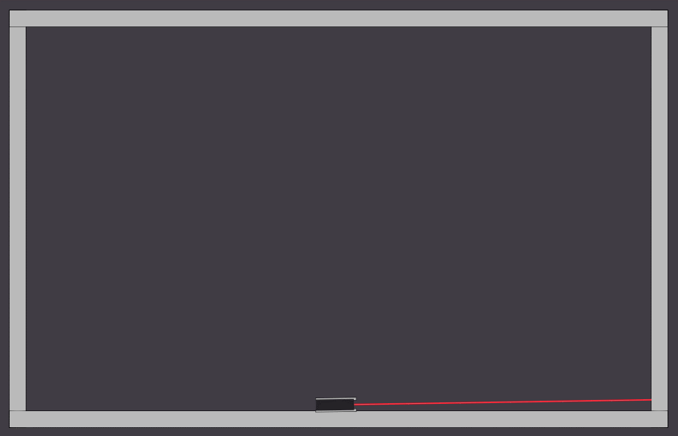

# laser
What if you could grab a laser? And swing around a laser emitter with it?

This is just a silly little physics puzzle game mechanic prototype (GONE WRONG).

[Currently](https://rawgit.com/1j01/laser/master/index.html) it feels horrible to control,
but I'm sure there's some simple way to do it where it wouldn't.

The game would be mechanically 2D but could be 3D and use
[this cool laser effect](http://jeromeetienne.github.io/threex.laser/examples/demo.html).

I don't know what the puzzles would be though.
Especially since you can grab it right near the emitter and essentially drag the laser emitter around directly.
So it's probably not a good mechanic idea anyways.
Oh, maybe the areas where you can interact are limited as part of the level design (i.e. there's a grate or some tinted glass in between you and the laser).
That could probably work. I dunno.

P.S. WARNING: LINKS TO TV TROPES [Hard Light](http://tvtropes.org/pmwiki/pmwiki.php/Main/HardLight) / [Pure Energy](http://tvtropes.org/pmwiki/pmwiki.php/Main/PureEnergy) I guess.
